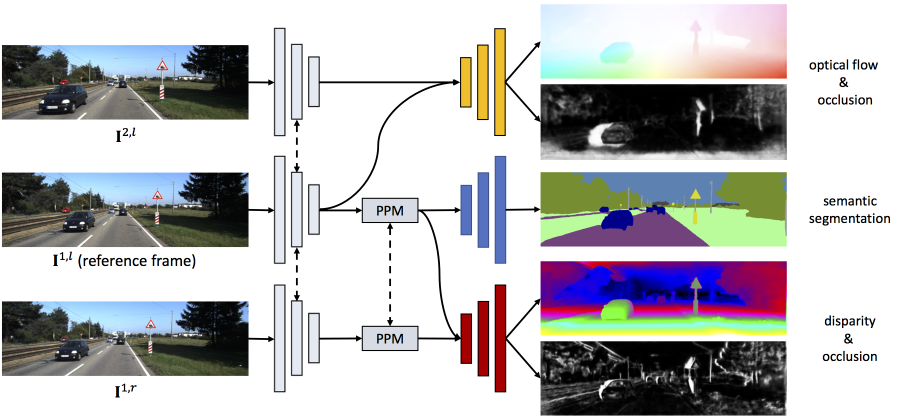

# SA

## SENSE: a Shared Encoder for Scene Flow Estimation
PyTorch implementation of our ICCV 2019 Oral paper [SENSE: A Shared Encoder for Scene-flow Estimation](https://arxiv.org/pdf/1910.12361.pdf).

<p align="center">
  
</p>


## Requirements
* Python (tested with Python3.6.10)
* PyTorch (tested with 1.3.0)
* SynchronizedBatchNorm (borrowed from https://github.com/CSAILVision/semantic-segmentation-pytorch)
* tensorboardX
* tqdm
* OpenCV
* scipy
* numpy

```shell
conda env create -f sense_conda_environment.yaml
conda activate sense
conda install -c conda-forge cudatoolkit-dev 
export CUDA_HOME=/path/to/env/
cd sense/lib/correlation_package
rm -rf *_cuda.egg-info build dist __pycache__
python setup.py install --user
```

All experiments were conducted on 8 2080ti GPUs (each with 11GB memory) or 2 M40 GPUs (each with 24GB memory).

In our original implementation, we used a C++ implementation for the cost volume computation for both optical flow and stereo disparity estimations. But the C++ implementatyion strictly requires a PyTorch version of 0.4.0. In this relased version, we switched to use the implemtnation provided at <https://github.com/NVIDIA/flownet2-pytorch>. We use this implementation for stereo disparity estimation, although it only supports cost volume computation for optical flow (searching for correspondence in a local 2D range). Please consult our paper if you are interested in the running time and GPU memory usuage.

## Quick Start
First run `sh scripts/download_pretrained_models.sh` to download pre-trained models. Run `python tools/demo.py` then for a quick demo.

## Training
See [TRAINING.md](TRAINING.md) for details.

## Issues
### ninja: error: loading 'build.ninja': No such file or directory
Replace Line 8 with `cxx_args = ['-std=c++14']`. Making this change in all the setup.py files should fix the issues.[Issue#227](https://github.com/NVIDIA/flownet2-pytorch/issues/227#issuecomment-688047690)
### v = obj.cuda(dev, async=True) SyntaxError: invalid syntax
Replace `async` with `non_blocking`. Refer to this [answer](https://stackoverflow.com/a/53212781) on stackoverflow.
